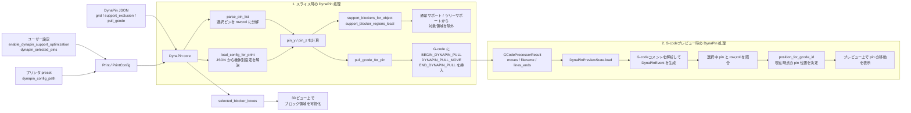

テスト

```mermaid
flowchart LR
    U[ユーザー設定<br/>enable_dynapin_support_optimization<br/>dynapin_selected_pins] --> P[Print / PrintConfig]
    M[プリンタ preset<br/>dynapin_config_path] --> P
    J[DynaPin JSON<br/>grid / support_exclusion / pull_gcode] --> D[DynaPin core]

    P --> D

    subgraph Slice["1. スライス時の DynaPin 処理"]
        D --> C1[parse_pin_list<br/>選択ピンを row,col に分解]
        D --> C2[load_config_for_print<br/>JSON から機体別設定を解決]
        C1 --> G1[pin_y / pin_z を計算]
        C2 --> G1

        G1 --> B1[support_blockers_for_object<br/>support_blocker_regions_local]
        B1 --> S1[通常サポート / ツリーサポートから<br/>対象領域を除外]

        G1 --> G2[pull_gcode_for_pin]
        G2 --> GC[G-code に<br/>BEGIN_DYNAPIN_PULL<br/>DYNAPIN_PULL_MOVE<br/>END_DYNAPIN_PULL を挿入]
    end

    subgraph Preview["2. G-codeプレビュー時の DynaPin 処理"]
        GC --> R1[GCodeProcessorResult<br/>moves / filename / lines_ends]
        R1 --> P1[DynaPinPreviewState.load]
        P1 --> P2[G-codeコメントを解析して<br/>DynaPinEvent を生成]
        P2 --> P3[選択中 pin と row,col を照合]
        P3 --> P4[position_for_gcode_id<br/>現在時点の pin 位置を決定]
        P4 --> V[プレビュー上で pin の移動を表示]
    end

    D --> O[selected_blocker_boxes]
    O --> V2[3Dビュー上で<br/>ブロック領域を可視化]
```
