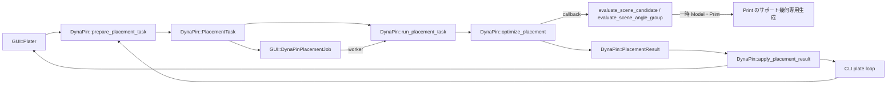

# DynaPin 配置最適化のクラス設計・プログラム仕様

対象: 2026-09-21 時点の作業ツリー。探索の目的・候補数・評価式・GUI上の振る舞いは [配置最適化の動作仕様](DYNAPIN_PLACEMENT_SPEC.md) にまとめる。本書は C++ の型、API、所有関係、呼び出し順、変更時の境界を扱う。

## 設計の骨格

探索本体を表す状態付きクラスは置かず、`Slic3r::DynaPin` 名前空間の不変な `PlacementTask` と関数で準備・実行・適用を構成する。GUI の `DynaPinPlacementJob` は非同期実行の薄いアダプターであり、CLI は同じAPIを同期実行する。GUIのUndoや再スライス制御、CLIのプレートループや検証は各呼び出し側に残す。

## 型と所有権

| 型 / 所在 | フィールド・意味 | 所有関係と不変条件 |
| --- | --- | --- |
| `DynaPin::PlacementCandidate` / `DynaPinPlacement.hpp` | `rotation_deg`、`delta_y`。開始姿勢からの相対変換 | 値型。候補の同一性は内部 `CandidateKey` で角度正規化と座標丸めを使い、`operator==` 自体はフィールドの厳密比較。 |
| `DynaPin::DeltaYInterval` | `min`、`max`、単位 mm | 値型。有効範囲は `min <= max`。生成関数は無効入力に `nullopt` を返す。 |
| `DynaPin::SupportSlab` | `z_min`、`z_max`、`Polygons` | 値型。XY は共通の plate-local 座標系、Z は mm。重なるスラブの体積は union で一度だけ計上する。 |
| `DynaPin::PlacementEligibility` | DynaPin/配置の有効化、自動ピン選択、Normal サポート、選択数 | GUI が起動時にコピーし、`valid()` が実行条件を判定する。生きた GUI 状態への参照を持たない。 |
| `DynaPin::PlacementSceneSnapshot` | `shared_ptr<const Model>`、`DynamicPrintConfig`、対象 ID、初期変換、中心、プレート形状・高さ・原点・番号 | GUI で作成したモデルのコピーを所有する。`const Model` 共有ポインタだが、候補評価時にはさらに `Model` を複製する。変更中の `Plater` を worker から参照しない。 |
| `DynaPin::PlacementSearchInput` | pitch、Y 範囲、現在姿勢・体積、範囲計算/角度評価 callback、並列設定、資源 probe | 探索を駆動する入力。callback の capture は呼び出し終了まで有効であること。GUI の `delta_y_range_for_rotation` は `scene` を値で capture する。 |
| `DynaPin::PlacementResult` | `status`、`candidate`、`volume_mm3`、評価回数、警告 | `Improved` の場合だけ候補をライブモデルへ適用できる。`Unchanged` は現在姿勢を返す。失敗時の候補・体積を有効値として扱わない。 |
| `DynaPin::PlacementTask` | eligibility、search、scene | GUI型に依存しない共通の不変入力。準備成功時だけ `PlacementPreparationResult::task` に入る。 |
| `DynaPin::PlacementPreparationResult` / `PlacementApplyResult` | taskまたは理由、適用有無または理由 | 例外で表さない通常の不適格・古い結果を呼び出し側へ返す。 |
| `GUI::DynaPinPlacementSnapshot` / `DynaPinPlacementJob.hpp` | 共通 `PlacementTask` と `input_generation` | GUI固有の世代値だけを追加する。探索条件や対象IDは重複保持しない。 |
| `GUI::DynaPinPlacementJob` | snapshot、apply/completion callback、result、applied フラグ | `Job` の派生クラス。`process()` が探索結果を設定し、`finalize()` が UI thread の適用 callback を呼ぶ。apply callback が安全性検証を所有する。 |

`Slic3r::DynaPin` は幾何と探索の名前空間として整合している。`Slic3r::GUI` に置かれたジョブと GUI snapshot も適切。`PlacementSceneSnapshot` と `DynaPinPlacementSnapshot` は前者が評価可能な不変シーン、後者がジョブ制御用の包みであり、似た名前だが別の責務を持つ。

## 公開 API の契約

### 幾何と候補生成

| 関数 | 入力→出力 | 副作用・使用箇所 |
| --- | --- | --- |
| `placement_delta_y_range_for_bbox()` | ベッド/モデル bbox の Y 境界 → 実行可能 `DeltaYInterval` または `nullopt` | 純粋関数。bbox のみによる予備判定。 |
| `placement_delta_y_range_for_scene()` | snapshot、角度 → その回転の Y 範囲 | snapshot の `Model` を読み、対象モデルの part-volume bbox を計算する。 |
| `placement_delta_y_interval()` | 実行可能範囲、pitch → 最大一ピッチの探索区間 | 純粋関数。片側が切れる場合は区間をずらす。 |
| `coarse_candidates()` / `local_candidates()` | 区間または種、pitch → 候補列 | 純粋関数。前者は固定区間の API。実シーンでは `optimize_placement()` 内の角度別区間生成経路を使う。 |
| `normalized_rotation_deg()` / `rotation_distance_deg()` | 角度 → 正規化角/最短角距離 | 純粋関数。候補重複や同点順位に使う。 |
| `candidate_transform()` | 初期行列、中心、相対角、Δy → 新行列 | 純粋関数。必ず初期行列から計算し候補間の変換を蓄積しない。 |
| `support_volume_mm3(slabs)` | plate-local `SupportSlab` 群 → mm³ | Z 境界で区切り、XY union を積分。無効 Z 境界は例外。`support_volume_mm3(Print)` は生成済みサポートレイヤーから同じ値を求める別 overload。 |

### 評価と探索

`PlacementEvaluator` は `PlacementCandidate → optional<double>`。`nullopt` は実行不能、有効な非負値は体積 mm³。`evaluate_scene_candidate()` は単体候補の完全な一時評価を実装する。`make_scene_evaluator()` は snapshot を値 capture した `PlacementEvaluator` を返す。`AngleGroupEvaluator` は同角度の候補列を受けて結果配列を埋め、候補完了 callback を通知する。`evaluate_scene_angle_group()` は同角度の `Print` とスライス準備を再利用し、`make_scene_angle_evaluator()` が snapshot を保持する callback に変換する。

`optimize_placement(input, evaluator, cancel, progress, progress_stage)` は現在姿勢を単体 evaluator で最初に測る。`input.angle_evaluator` があれば残りの候補を角度別に評価し、なければ単体 evaluator で評価する。戻り値は常に `PlacementResult`。`cancel` は polling 型で、進捗 callback はパーセント、段階 callback は `PlacementProgressStage` を受ける。並列評価中の callback は worker 側から呼ばれるため、GUI へ渡す実装はスレッド安全でなければならない。`DynaPinPlacementJob` は `Ctl::update_status()` へ橋渡しする。

`prepare_placement_task()` は対象解決、DynaPin設定と適格性の検証、scene/search構築を一度だけ行う。対象IDが指定された場合はその印刷可能インスタンスを使い、未指定ならプレート上の印刷可能インスタンスが1個の場合だけ自動選択する。`run_placement_task()` はscene evaluatorを生成して同じ探索器を呼ぶ。`apply_placement_result()` は `Improved`、対象ID一致、初期変換一致を確認してから候補を適用し、bboxを無効化する。

`PlacementResliceAction placement_reslice_action(...)` と `placement_job_should_continue_reslice(...)` は GUI の再スライス制御を純粋関数にした API。`Plater` に依存しないため単体テスト可能だが、ドメイン探索ではなく UI orchestration の責務を `libslic3r` に公開している。

## 実行時のシーケンスと変更可能な状態

1. **UI thread / `Plater::reslice()`**: 現在プレートの `Print` を更新し、一回限りのガードとworker状態を判定する。
2. **UI thread / `Plater::start_dynapin_placement()`**: 選択IDとプレート情報を `prepare_placement_task()` に渡し、共通taskとmodified countを固定する。
3. **worker / `DynaPinPlacementJob::process()`**: `run_placement_task()` にキャンセルと進捗callbackを渡す。ライブの `Plater`/`Model`/`Print` を変更しない。
4. **worker / 評価 API**: 候補ごとまたは角度群ごとに一時 `Model`/`Print` を変更する。`Print::prepare_slices_for_support_geometry()`、`Print::generate_normal_support_geometry_for_current_shift()`、`PrintObjectSupportMaterial::generate_geometry_only()` を通り、サポート幾何だけを採取する。`Print::update_dynapin_selection()` は候補姿勢に合わせて一時 `Print` のピン選択を更新する。
5. **UI thread / `DynaPinPlacementJob::finalize()`**: `Plater` はプレート番号とmodified countを確認し、`apply_placement_result()` の適用直前callbackでUndo snapshotを取る。共通APIが対象IDと初期行列を照合する。
6. **UI thread / completion callback**: 継続可能ならガード付きで `reslice()` を呼ぶ。ガードは次の `reslice()` の入口で消費され、最適化の再帰起動を防ぐ。

CLIは最初の `Print::apply()` と検証後に対象未指定でtaskを準備し、同期探索する。改善時だけ共通適用APIを呼び、`Print::apply()` と検証をやり直す。再検証に失敗した場合は初期変換へ戻して再applyし、元配置でG-code生成を続ける。変更は実行中のplate modelだけに入り、入力3MFへ保存しない。

### 重要な境界

- snapshot の `model` は共有所有される `const Model`、一時 evaluator の `Model` はコピーである。両者を混同して worker から元モデルを書き換えない。
- `SupportSlab::polygons` は object-local のまま集計しない。`Print::generate_normal_support_geometry_for_current_shift()` で `shift_without_plate_offset()` を加え、共通 plate-local 座標へ変換する。
- 角度別 evaluator は `Print` を再利用するので、サポート生成後の一時状態の復元が必須。`PrintObjectSupportMaterial::generate_geometry_only()` はレイヤー上の `sharp_tails` 等を保存・復元する。
- `PlacementResult::evaluations` は完了通知された候補の数を含む実行記録であり、成功した候補だけの数ではない。最初の現在姿勢評価も一回として数える。
- callback に渡す `PlacementSceneSnapshot`、ジョブ snapshot の寿命はジョブの終了まで。`Plater` のポインタを保持する apply/completion callback は UI 側でのみ実行する設計である。

## 変更を検討する際の設計課題

現行 API は `PlacementSearchInput` に固定 Y 範囲、回転別範囲、単体・角度別 evaluator、資源 probe を同居させている。これは実シーンと純粋探索テストの両方を支える一方、どの組み合わせが有効かを型で表現できない。分割するなら探索条件と評価戦略を別の型にし、実シーン/テスト用の構築関数で整合性を保証するのが候補である。

`DynaPinPlacement.hpp` は `PrintConfig.hpp`、`Utils.hpp`、Eigen 等を公開依存に含むため、広い再コンパイルを招き得る。`PlacementSceneSnapshot` と資源 probe 型を詳細ヘッダーへ分け、候補・結果・探索関数だけの軽い API を設ける案がある。ただし境界変更とビルド効果は実測して決める。GUI 再スライス判定を GUI 側へ移す案も、既存の純粋関数テストを保ったまま検討する。これらは**現行仕様ではなく設計改善候補**である。

## 対応コードと検証

- 公開型・関数: `src/libslic3r/DynaPinPlacement.hpp`
- 探索・評価実装: `src/libslic3r/DynaPinPlacement.cpp`
- サポート幾何専用の入口: `src/libslic3r/Print.cpp`、`PrintObject.cpp`、`Support/SupportMaterial.cpp`
- ジョブ: `src/slic3r/GUI/Jobs/DynaPinPlacementJob.hpp/.cpp`
- 起動・適用: `src/slic3r/GUI/Plater.cpp`
- CLI同期実行・再検証: `src/OrcaSlicer.cpp`
- 契約テスト: `tests/libslic3r/test_dynapin_placement.cpp`

API または状態復元を変更する場合は、単体候補と角度群の評価一致、キャンセル時の非適用、古い snapshot の棄却、プレート座標の体積集計、メモリ制御、ガード付き再スライスを確認する。
